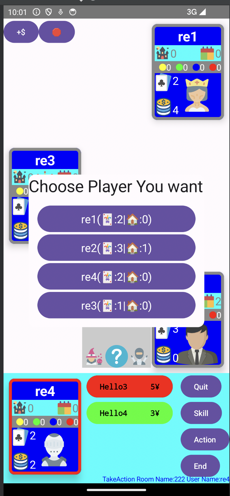

# Citadels - Online Multiplayer Board Game

An Android implementation of the classic board game **Citadels**, featuring real-time multiplayer gameplay powered by Firebase. This project demonstrates modern Android development practices with Kotlin and Jetpack Compose.



## 📋 Table of Contents

- [Overview](#overview)
- [Technical Stack](#technical-stack)
- [Architecture](#architecture)
- [Key Features](#key-features)
- [Project Structure](#project-structure)
- [Game Engine](#game-engine)
- [Firebase Integration](#firebase-integration)
- [Build Configuration](#build-configuration)
- [Installation](#installation)
- [Game Rules](#game-rules)

## 🎮 Overview

Citadels is a strategic card game where players assume roles of medieval characters to build districts and compete for points. This Android implementation brings the beloved board game online with real-time multiplayer support, allowing players to create and join game rooms over the internet.

## 🛠 Technical Stack

### Core Technologies

- **Language**: Kotlin (1.8.10)
- **UI Framework**: Jetpack Compose (BOM 2023.10.01)
- **Android SDK**: 
  - Compile SDK: 34
  - Min SDK: 30
  - Target SDK: 33
- **Build System**: Gradle with Kotlin DSL (8.1.1)

### Libraries & Frameworks

#### UI & Lifecycle
- `androidx.compose.material3` - Material Design 3 components
- `androidx.compose.ui` - Declarative UI framework
- `androidx.activity:activity-compose:1.8.0` - Integration layer
- `androidx.lifecycle:lifecycle-runtime-ktx:2.6.2` - Lifecycle management
- `androidx.lifecycle:lifecycle-viewmodel-ktx` - ViewModel support

#### Firebase Services
- `firebase-firestore` - Real-time NoSQL database
- `firebase-auth` - User authentication
- `firebase-analytics-ktx` - Analytics tracking
- `firebase-crashlytics:18.5.1` - Crash reporting
- `firebase-bom:32.5.0` - Firebase Bill of Materials

#### Development Tools
- `kotlin-parcelize` - Parcelable implementation generator
- JUnit 4.13.2 - Unit testing
- Espresso 3.5.1 - UI testing

## 🏗 Architecture

The project follows a clean architecture pattern with clear separation of concerns:

```
citadels.project/
├── game/                    # Core game logic layer
│   ├── GameEngine.kt       # Central game state manager
│   ├── Characters.kt       # Character abilities & definitions
│   ├── Player.kt           # Player data model
│   ├── Districts.kt        # District card definitions
│   ├── Deck.kt             # Card deck management
│   ├── Rules.kt            # Game rule implementations
│   └── Utils.kt            # Game utility functions
├── MainActivity.kt         # Entry point & room management UI
├── RoomActivity.kt         # In-game activity
├── RoomManager.kt          # Firebase room operations
├── UserManager.kt          # User authentication & profiles
├── PlayerBox.kt            # Player UI component
├── Dialog.kt               # Dialog system for player choices
└── ui/theme/               # Material Design 3 theming
```

### Design Patterns

1. **MVVM Pattern**: Separation between UI (Compose), ViewModel logic, and data models
2. **Repository Pattern**: `RoomManager` and `UserManager` act as data repositories
3. **Observer Pattern**: Firebase snapshot listeners for real-time updates
4. **State Management**: Kotlin coroutines with `StateFlow` for reactive UI updates
5. **Factory Pattern**: `DialogFactory` for creating selection dialogs

## ✨ Key Features

### Real-Time Multiplayer
- Create and join game rooms with custom names
- Real-time synchronization using Firebase Firestore
- Automatic room state updates across all connected players
- Player presence management

### Game Logic
- Complete implementation of Citadels rules
- 8 unique character roles with special abilities:
  - **Assassin**: Eliminate another character for the round
  - **Thief**: Steal gold from another character
  - **Magician**: Swap hands with another player
  - **King**: Gain crown and gold from noble districts
  - **Bishop**: Protected from Warlord, earn from religious districts
  - **Merchant**: Earn extra gold and from trade districts
  - **Architect**: Draw and build extra cards
  - **Warlord**: Destroy districts and earn from military districts

### User Interface
- Modern Material Design 3 implementation
- Fully declarative UI with Jetpack Compose
- Responsive layouts with proper keyboard handling
- Loading states and progress indicators
- Custom player card displays with real-time updates

### State Management
- Coroutine-based asynchronous operations
- Efficient state updates using `remember` and `mutableStateOf`
- Debounced input validation for room names
- Proper lifecycle management to prevent memory leaks

## 📁 Project Structure

### Game Engine (`GameEngine.kt`)

The `GameEngine` class is the heart of the game logic:

```kotlin
data class GameEngine(
    var roomID: String = "DefaultID",
    val players: List<Player> = listOf(),
    var deck: Deck = Deck(),
    var currentPlayerIndex: Int = 0,
    var gameStatus: GameStatus = GameStatus.ChooseCharacter,
    var isGameRunning: Boolean = false
)
```

**Key Responsibilities:**
- Manages game phases (character selection → action phase)
- Handles player turns and character ordering
- Processes player actions (draw cards, collect gold, build districts)
- Calculates scoring with bonuses
- Synchronizes state to Firebase

**Game Flow:**
1. `setupGame()` - Initialize deck and distribute starting resources
2. `GameStatus.ChooseCharacter.start()` - Players select characters
3. `GameStatus.TakeAction.start()` - Players perform actions in character order
4. `nextPlayerToTakeAction()` - Advance to next character
5. Repeat until win condition (8 districts built)

### Room Management (`RoomManager.kt`)

Handles all Firebase Firestore operations:

```kotlin
class RoomManager {
    companion object {
        suspend fun createRoom(roomId: String, gameEngine: GameEngine): Room
        suspend fun joinRoom(roomId: String, user: User)
        suspend fun syncData(gameEngine: GameEngine)
        fun listenToRoomUpdates(roomName: String, onResult: (Room) -> Unit)
    }
}
```

**Features:**
- Asynchronous room creation and joining with coroutines
- Real-time snapshot listeners for live updates
- Array field manipulation for player list management
- Efficient document queries with `whereEqualTo` indexing

### Character System

Each character is implemented as an enum with polymorphic behavior:

```kotlin
enum class CharacterType {
    ASSASSIN {
        override fun skill(gameEngine: GameEngine, self: Player) {
            // Assassination logic
        }
    },
    THIEF {
        override fun skill(gameEngine: GameEngine, self: Player) {
            // Stealing logic
        }
    }
    // ... 6 more characters
}
```

Characters include:
- Unique skill implementations
- Associated drawable resource IDs for UI
- Turn order based on enum position

## 🔥 Firebase Integration

### Firestore Schema

```javascript
/rooms/{roomId}
{
  name: string,              // Display name for the room
  gameEngine: {
    roomID: string,
    players: Array<Player>,  // Player array with user data
    currentPlayerIndex: number,
    gameStatus: string,
    deck: {
      drawPile: Array<District>,
      discardPile: Array<District>
    },
    // ... additional game state
  }
}
```

### Real-Time Synchronization

The app uses Firestore's snapshot listeners for instant updates:

```kotlin
fun listenToRoomUpdates(
    roomName: String,
    onResult: (Room) -> Unit,
    onError: (Exception?) -> Unit
) {
    roomsCollection.whereEqualTo("name", roomName).limit(1)
        .addSnapshotListener { snapshot, e ->
            val room = snapshot?.documents?.firstOrNull()?.toObject(Room::class.java)
            if (room != null) onResult(room)
        }
}
```

### Data Synchronization Strategy
- **Optimistic Updates**: Local state updates immediately
- **Background Sync**: `syncData()` writes to Firestore asynchronously
- **Conflict Resolution**: Last-write-wins with Firestore's timestamp ordering
- **Efficient Updates**: Only modified fields are sent via `update()`

## 🔧 Build Configuration

### Gradle Setup (`build.gradle.kts`)

```kotlin
android {
    namespace = "citadels.project"
    compileSdk = 34
    
    defaultConfig {
        applicationId = "citadels.project"
        minSdk = 30
        targetSdk = 33
        versionCode = 1
        versionName = "1.0"
    }
    
    buildFeatures {
        compose = true
    }
    
    composeOptions {
        kotlinCompilerExtensionVersion = "1.4.3"
    }
}
```

### Firebase Configuration
- `google-services.json` required in `app/` directory
- Firebase services initialized in `MainActivity.onCreate()`
- Crashlytics auto-reporting for production builds

## 📦 Installation

### Prerequisites
- Android Studio Hedgehog | 2023.1.1 or later
- JDK 8 or higher
- Android SDK with API level 30+
- Firebase project with Firestore enabled

### Setup Steps

1. **Clone the repository**
   ```bash
   git clone <repository-url>
   cd citadelsproject
   ```

2. **Configure Firebase**
   - Create a Firebase project at [Firebase Console](https://console.firebase.google.com/)
   - Add an Android app with package name `citadels.project`
   - Download `google-services.json` and place in `app/` directory
   - Enable Firestore, Authentication, Analytics, and Crashlytics

3. **Build the project**
   ```bash
   ./gradlew build
   ```

4. **Run on device or emulator**
   ```bash
   ./gradlew installDebug
   ```

### Firestore Security Rules

```javascript
rules_version = '2';
service cloud.firestore {
  match /databases/{database}/documents {
    match /rooms/{roomId} {
      allow read, write: if request.auth != null;
    }
  }
}
```

## 🎯 Game Rules

Citadels is a strategy game where players compete to build the most impressive medieval city. For detailed rules, the app includes a link to: https://play-citadels.online/rules

### Quick Overview

**Objective**: Build 8 districts first and earn the highest score

**Gameplay**:
1. Each round, players secretly select a character
2. Characters act in order, using their special abilities
3. On your turn: collect gold OR draw cards, then optionally build a district
4. Game ends when a player builds their 8th district

**Scoring**:
- Sum of district costs built
- +3 for first to 8 districts
- +3 for all 5 district types
- Character-specific bonuses

## 🧪 Testing

### Unit Tests
Located in `app/src/test/`:
- Game logic validation
- Scoring calculations
- Rule enforcement

### Instrumented Tests
Located in `app/src/androidTest/`:
- UI component testing with Compose
- Firebase integration tests
- End-to-end game flows

Run tests:
```bash
./gradlew test           # Unit tests
./gradlew connectedAndroidTest  # Instrumented tests
```

## 🔐 Security Considerations

- All Firebase operations require authentication
- Firestore rules enforce user verification
- No client-side game state manipulation allowed
- Crashlytics for monitoring suspicious activity

## 📈 Performance Optimizations

1. **Lazy Composition**: UI components render only when visible
2. **Efficient Recomposition**: Smart state management with `remember` and `derivedStateOf`
3. **Coroutine Dispatchers**: Background operations on `Dispatchers.IO`
4. **Firestore Queries**: Indexed queries with `.limit(1)` for room lookups
5. **Parcelize**: Efficient data passing between activities

## 🚀 Future Enhancements

- [ ] Implement chat system for player communication
- [ ] Add game replay and history
- [ ] Support for different game variants and expansions
- [ ] AI opponents for single-player mode
- [ ] Matchmaking system for random opponents
- [ ] Achievement and statistics tracking
- [ ] Tablet-optimized layouts
- [ ] Localization support

## 📄 License

This project is developed for educational purposes.

## 👥 Contributing

Contributions are welcome! Please feel free to submit pull requests or open issues for bugs and feature requests.

## 🙏 Acknowledgments

- Citadels board game designed by Bruno Faidutti
- Firebase for providing robust backend infrastructure
- Android Jetpack team for Compose framework
- Open source community for various libraries and tools

---

**Built with ❤️ using Kotlin and Jetpack Compose**
